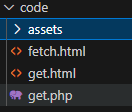
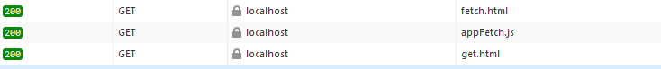
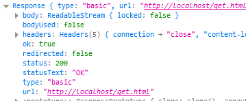
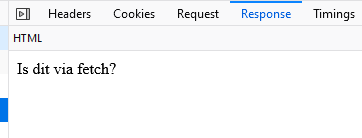

## STEL

- we hebben dus die `get.html`
    - Die we willen ophalen:  
    

- dan kunnen we dat zo doen:
    ```JS
    fetch("get.html")
    .then((response)=>
    {
    console.log(response);
    });
    ```

## Resultaten

- Je ziet hieronder de `HTTP GET` van onze `fetch`  
    > 
- En in de `console` de `HTTPRequest` waar je mee kan werken:
    > 
- In je Debugger:  
    > 


<a href="03 Fetch4.md" >Next</a>
