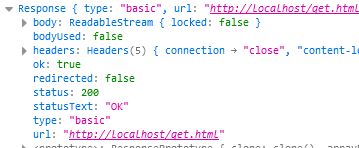
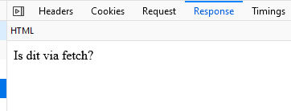
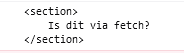

    
## Fetch uitleg

- `Fetch` is `async` dat betekent:
    - Je laat je code uitvoeren
    - En koppelt een `Als je klaar bent` stuk code
        - de `.then()`

> Deze manier van werken heet `promises` in javascript

#### VOORBEELD CODE
```JS
fetch("URL")
.then((response)=>
{
  return response.json();
});
```
> - tussen de `()` van `fetch` komt je `url` als `string`
>   - bijvoorbeeld: `"get.html"`


<a href="03 Fetch3.md" >Next</a>

## STEL

- we hebben dus die `get.html`
    - Die we willen ophalen:  
    

- dan kunnen we dat zo doen:
    ```JS
    fetch("get.html")
    .then((response)=>
    {
    console.log(response);
    });
    ```

## Resultaten

- Je ziet hieronder de `HTTP GET` van onze `fetch`  
    > 
- En in de `console` de `HTTPRequest` waar je mee kan werken:
    > 
- In je Debugger:  
    > 


<a href="03 Fetch4.md" >Next</a>

## hoe werkt de .then()?

> - `.then` is een `function`
>     - met `1 argument`: een andere `function`
>        - deze wordt aangeroepen `NADAT` de fetch `klaar` is
>           - de promise is `fulfilled`


## Function doorgeven

- Wat betekent dit nou eigenlijk?
```JS
(response)=> //  1 argument 
{//hier begint de function body
  console.log(response);//wat je doet
}
```
 
De code hierboven is gelijk aan:
```JS
function (response)
{
  console.log(response);//wat je doet
}
```


<a href="03 Fetch5.md" >Next</a>

## En de data dan?

- Nu zien we alleen de HTTPResponse
    - Niet wat erin zit
    - En wij willen wat erin zit gebruiken

```JS
fetch("get.html")
.then((response)=>
{
  return response.text();// lees de BODY uit en maak er HTML van
})
.then((htmlcontent)=>
{
  console.log(htmlcontent);
});

```

## Resultaat:
- In je Debugger zie je de HTML als text verschijnen:  
    > 


<a href="03 Fetch6.md" >Next</a>

## PHP

- je kan ook tegen PHP praten:

- Stel je hebt deze PHP:
```PHP
<?php 

echo "Hello fetch!";

?>
```

- Dan `verander` je de url
```JS
fetch("get.php")
.then((response)=>
{
  return response.text();// lees de BODY uit en maak er TEXT van
})
.then((htmlcontent)=>
{
  console.log(htmlcontent);
});
```

- en krijg je:
    > 


## Waar kan ik er meer over lezen?

> De fetch API staat goed beschreven op deze pagina:
> - https://developer.mozilla.org/en-US/docs/Web/API/Fetch_API


<a href="03 Fetch7.md" >Next</a>


## POST & Fetch options

- vaak gebruiken we `fetch` om een `HTTP POST`
    - dan moeten we in de `options` meegeven wat we willen:

 ```JS
 let options = 
{
  method: "POST", 
  cache: "no-cache",
  headers: { "Content-Type": "application/json" }
}

fetch("post.php",options)
.then((response)=>
{
  console.log(response);
});

 ```


## POST

- wordt gebruikt om veel data door te geven bijvoorbeeld:
    - contact formulieren
    - uploads van images


<a href="03 Fetch8.md" >Next</a>


## Opdracht voor deze week:


https://github.com/progsen/M6-PROG-2023-2024/tree/main/03%20json

> 


