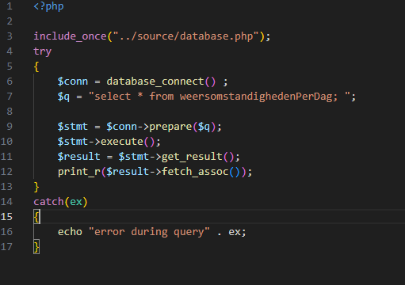

## Php database insert

- `PHP` heeft ook de mogelijkheid om andere `SQL` te draaien
    - `Insert` (voeg nieuwe data toe)
    - `Update` (verander de data)

- Afhankelijk van de `rechten` van je `login` die je application gebruikt
    - meer `rechten` = meer `gevaar`
    - DUS! altijd de `minste` rechten geven!

## Reminder Select

- we gebruiken even de `weertabel` als voorbeeld:
    > 
    - `idWeersomstandighedenPerDag` krijgt met `auto_increment` een `waarde`
- code voorbeeld:
    > 

- resultaat:
    > 

## Insert SQL

- Eerst even de Insert SQL herhalen:
    > 

- Dus:
    > - INSERT into *`TABEL_NAAM`* (*`WELKE_COLOMMEN`*) VALUES (*`WAARDES`*);`
    - *`WELKE_COLOMMEN`* en *`WAARDES`* moeten evenveel `items` en `,'s` bevatten
    - Je mag meerdere rijen tegelijk doen:
        > VALUES (*`WAARDES`*), (*`WAARDES`*), (*`WAARDES`*);

## Insert

- de php `Insert` code lijkt heel veel op de select code:
    > 

## Prepare

- kijk nog even naar de prepare:
    > 

- daar staat `"sdids"`
    - `s` = een `string`
    - `d` = een `float` of `decimal` dus `1.9`
    - `i` = een `integer` dus `9`

## Execute

- een insert heeft geen resultaat
    - alleen een `boolean` of het gelukt is
    > 
    - `1`? yup dat is ook een `boolean` 
        - een `boolean` is `0` en `1` in `binary`
    
## Opdracht voor deze week:

https://github.com/progsen/M6-PROG-2023-2024/tree/main/04%20inserts

> 

