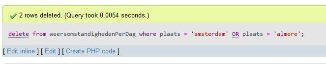

## Update

- `SQL` updates passen data aan in een `rij` of `rijen`
    - `99.99999%` van de tijd gebruiken we ook een `WHERE`
        - WHERE id = 123
        - WHERE naam = leraar
        > anders passen we alle data aan 

## Update SQL

- we gebruiken even de `weertabel` als voorbeeld:
    > 

    
## Update SQL

- nu draaien we een update voor `DEN BOSCH`
    - `id = 2`
        > 

- dan krijgen we:
    > 

    
## Meerdere rijen

- Stel ik doe het volgende:
    > 
- dan krijgen we:
    > 

- *LET DUS OP*

## Bewust meerdere rijen

- Stel ik doe het volgende:
    > 
- dan krijgen we:
    > 

## WHERE

- je `WHERE` is dus `erg` belangrijk
    - je kan `AND` of `OR` gebruiken 
    - bedenk dus `goed` wat je selecteren

## DELETE

- de `DELETE` heeft veel met de `WHERE` te maken
    - `WAT` wil ik verwijderen

- voorbeeld:
    > 

## GOED TESTEN

- voordat je een `DELETE` test:
    - maak eerst even de `SELECT`

- dus de `DELETE` `hieronder`:
    > 
- wordt:
    > 

## Uitvoeren

- als je die `select test` doet, zie je wat *GEDELETE* `zou` worden:
    > 
- is dat goed? dan kan je de `DELETE` testen:
    > 

## Opdracht voor deze week:

https://github.com/progsen/M6-PROG-2023-2024/tree/main/05%20imagetable

> 

